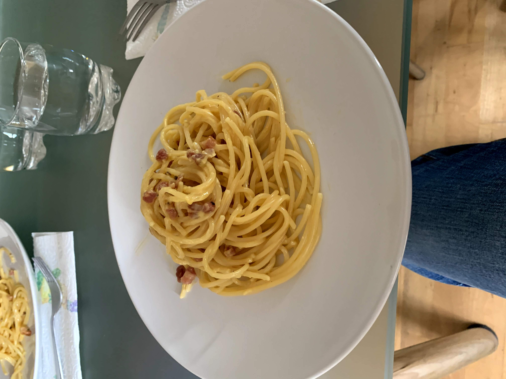

# Carbonara pasta

Difficulty | Time
--- | ---
Easy | 10 mins

## Ingredients

* Spaghetti Pasta - 80g (~) per person
* Black Pepper
* Eggs - 1 per person
* Pancetta
* Parmesan

## Procedure

### 1) Prepare the eggs

Break the eggs and split the yolk and the white, put the yolk in a bowl and
throw the white away

Mix the parmesan (keep a little bit for later) and the black pepper with the yolk and stir until you get a creamy mixture, should not be liquid!

### 2) Prepare the pancetta and boil the pasta

Set two pans to fire, one fry pan and one for the pasta. Once the fry pan is hot then set pancetta to cook and wait 'till is ready (crunchy, brown).

> Suggestion for pasta: is the bag says 9 mins cooking time then the right time is 7 mins!

### 3) Finish the egg mixture and drain the pasta

Take a little bit of water from the pasta pan and put it into the egg bowl. Mix the pancetta and the rest of the parmesan you got left from point 1, stir it until is more liquid than before. Then drain the pasta.

### 4) Mix & serve

At the end put the egg mixture in the pan where you cooked the pasta, stir fast.

### 5) Enjoy

